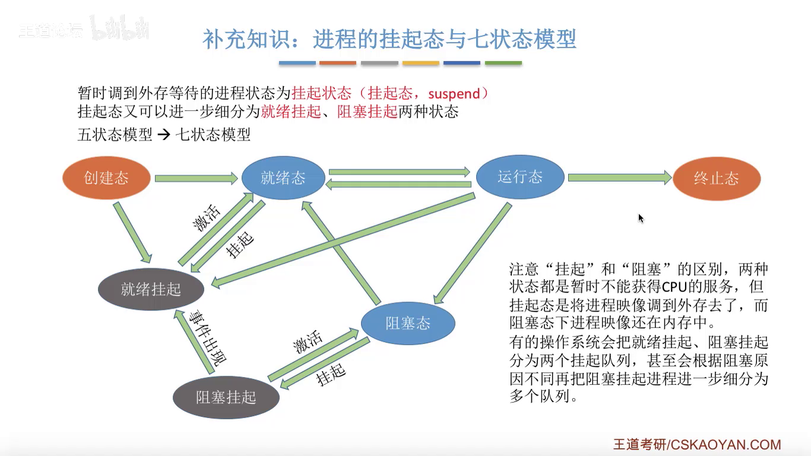

# 第二章

## 进程和线程

### 进程的定义，组成，组织方式，特征

#### 定义
操作系统为每个运行的程序配置一个数据结构，称为进程控制块PCB，用来描述进程额各种信息。

程序段，数据段，PCB三部分组成了进程实体（进程映像），一般情况下简称为进程。

PCB是进程存在的唯一标识

三种传统定义
1. 进程是程序的一次执行过程
2. 进程是一个程序机器数据在处理机上顺序执行时所发生的活动。
3. 进程是具有独立功能的程序在数据集合上运行的过程，他是系统进行资源分配和调度的一个独立单位。

引入进程实体之后，进程定义为
> 进程是进程实体的运行过程，是系统进行资源分配和调度的一个独立单位。

一般来讲，进程实体是静态的，而进程则是动态的，但是一般不强调时，认为进程实体就是进程

#### 组成

- 程序段
  - 存放程序代码
- 数据段
  - 程序运行时使用，产生的数据存放
- PCB： 操作系统通过PCB来管理进程，因此包含对进程管理需要的各种信息。 
  - 进程描述信息
    - 进程标识符PID
    - 用户标识符UID
  - 进程控制和管理信息
    - 进程当前状态
    - 进程优先级
  - 资源分配清单
    - 程序段指针
    - 数据段指针
    - 外设等
  - 处理机相关信息
    - 各种寄存器值

#### 组织方式

- 链接方式
  - 按照进程状态将PCB分为多个队列
  - 操作系统持有指向各个队列的指针
    - 执行指针， 仅指向`唯一`的PCB
    - 就绪队列指针
    - 阻塞队列指针
- 索引方式
  - 根据进程状态的不同，建立几张索引表
  - 操作系统持有指向各个索引表的指针
    - 执行指针
    - 就绪表指针
    - 阻塞表指针

#### 特征

- 动态性
- 并发性
- 独立性
  - 进程是能独立运行，获得资源，接受调度的基本单位
- 异步性
  - 由于并发性产生的
- 结构性

### 进程的状态和转换

状态
- 运行状态 running
  - 占有CPU，并正在执行
- 就绪状态 ready
  - 已经具备运行条件但是没有空闲的CPU因此暂时不能执行
- 阻塞状态 waiting/blocked
  - 因为等待某一事件而暂时不能运行。
- 创建状态 new
  - 进程正在被创建，操作系统为进程分配资源，初始化PCB
- 终止状态 terminated
  - 运行结束，回收相关资源。


状态之间的切换
- 就绪到运行
  - 进程被处理机调度
- 运行到就绪
  - 时间片到或者处理机被抢占
- 运行到阻塞
  - 进程用 系统调用 的方式申请某种资源或者请求等待某个事件的发生，是进程自身的`主动行为`, 因此不能从就绪态直接到阻塞态
- 阻塞到就绪
  - 申请的资源被分配，或等待的事件发生， 是一种`被动行为` 不能从阻塞态直接到运行态。


<br/>
<br/>
<div align=center>
    
    <br>
	<div style="color:orange; border-bottom: 1px solid #d9d9d9;
    display: inline-block;
    color: #999;
    padding: 2px;">五状态模型</div>
</div>
<br/>
<br/>
  
### 进程控制

#### 基本概念

进程控制指的是对系统中的进程进行有效的管理，实现进程状态之间的转换。

为了保持进程切换过程中不出错，采用原语实现进程控制。原语的特点是执行期间不允许中断，这种不可被中断的操作成为原子操作。

原语采用 关中断 和 开中断 实现的。 由于权限比较高因此只能在核心态下执行。 

#### 相关原语

原语要做的三类事情
1. 更新PCb中的信息
   1. 所有的进程控制原语一定都会修改进程状态标志
   2. 若剥夺了当前运行进程的CPU使用权，则必然要求保存其运行环境。
   3. 某进程开始运行前必然要恢复其运行环境。
2. 将PCB插入合适的队列
3. 分配/回收资源

进程的创建
- 创建原语
  - 申请空白PCB
  - 为新进程分配所需资源
  - 初始化PCB
  - 将PCB插入就绪队列
- 引起进程创建的事件
  - 用户登录
  - 作业调度
  - 提供服务
  - 应用请求

进程终止
- 撤销原语
  - 找到要终止的进程的PCB
  - 若正在运行则立即剥夺CPU并将CPU分配给其他进程
  - 终止其所有子进程
  - 将该进程的资源归还给父进程或者操作系统
  - 删除PCB
- 引起进程终止的事件
  - 正常结束
  - 异常结束
  - 外界干预

阻塞和唤醒 必须成对使用
- 阻塞
  - 阻塞原语
    - 找到PCB
    - 保护现场并设置PCB状态为阻塞态
    - 将PCB插入相应事件的等待队列
  - 引起阻塞的事件
    - 需要等待系统分配某种资源
    - 需要等待相互合作的其他进程完成工作
- 唤醒
  - 唤醒原语
    - 在事件等待队列中找到PCB
    - 将PCB从等待队列中移除设置为就绪状态
    - 将PCB插入就绪对列等待调度
  - 引起唤醒的事件
    - 等待事件的发生

进程切换
- 原语
  - 将运行环境存入PCB
  - PCB移入相应队列
  - 选择另一个进程执行， 并更新其PCB
  - 根据PCB恢复新进程所需的运行环境
- 事件
  - 当前运行时间片到
  - 有优先级更高的进程到达
  - 当前进程主动阻塞
  - 当前进程终止


### 进程通信

> 进程之间的信息交换，因为各自进程拥有的地址空间相互独立， 为了保证安全，一个进程不能直接访问另一个进程的地址空间


#### 共享存储

> 操作系统在多个进程之外的地方开辟一块地址空间用于共享数据， 但是进程对该地址空间的访问必须是互斥的。 


- 基于数据结构的共享
  - 对数据的格式如数据的大小有限制， 速度比较慢限制多是一种低级的通信方式
- 基于存储区的共享
  - 数据的格式仅有需要共享的进程决定，速度更快是一种高级的通信方式。


#### 消息传递

通过发送消息和接收消息两个原语实现
- 直接通信方式
  - 消息直接改到接收进程的消息缓冲队列上
- 间接通信方式
  - 消息要先发送到中间实体中。

#### 管道通信

> 管道是指用于连接读写进程的一个共享文件，实质上是内存中一个大小固定的缓冲区

1. 管道只能采用`半双工通信`，某一时间段内只能实现`单向`的传输。如果要实现双向同时通信， 则需要设两个管道。
2. 各个进程要互斥地访问管道
3. 数据以字符流的形式写入管道，当管道写满时，写进程的`write()`系统调用将被阻塞，等待读进程将数据读取走。当读进程将数据全部读取走后，管道变空，此时读进程的`read()`系统调用将被阻塞。
4. 如果没有写满，就不允许读。如果没读空，就不允许写。
5. 数据一旦被读出，就从管道中被抛弃，因此读进程最多只能有一个，否则就会出现读错数据的情况。


### 线程和多线程

#### 基本概念

> 线程 是一个基本的CPU执行单元，也是程序执行的流的最小单元

引入线程后，进程最作为除CPU之外的系统资源的分配单元， 即将打印机分配给某个进程

带来的变化
- 资源分配，调度
  - 传统进程机制中，进程是资源的分配，调度的基本单位
  - 引入线程之后，进程是资源分配的基本单位，线程是调度的基本单位
- 并发性
  - 传统线程机制中，只能进程间并发
  - 引入线程后，各线程之间也能并发， 提升了并发度
- 系统开销
  - 传统的进程间并发，需要切换进程的运行环境，系统开销很大
  - 线程间并发，如果是同一进程内的线程切换，则不需要切换进程环境，系统开销很小。

线程的属性
- 线程是处理机调度的单位
- 多核CPU计算机中，各个线程可以占用不同的CPU
- 每个线程都有一个线程ID，线程控制块TCB
- 线程也有就绪， 阻塞， 运行三种状态
- 线程几乎不拥有系统资源
- 同一进程的不同线程间共享进程的资源
- 由于共享内存地址空间，同一进程中的线程间通信无需系统干预
- 同一进程中线程的切换不会引起进程切换， 不同进程的线程切换则会引起进程的切换
- 同进程内线程切换系统开销很小
- 进程切换，系统开销很大


#### 实现方式

用户级线程： 由应用程序通过线程库实现， 所有的线程管理工作都由应用程序负责，线程的切换可以在用户状态下完成无需系统干预， 对操作系统透明， 对用户不透明

内核级线程： 线程的管理由操作系统内核完成，线程的切换只有在核心态下才能完成， 对用户和操作系统都不透明。


在同时支持用户级线程和内核级线程的系统中，可以将 n 个用户级线程映射到 m 个内核级线程上但是，只有`内核级线程才是处理机分配的单位`

#### 多线程模型

- 多对一
  - 多个用户级线程映射到一个内核级线程，每个用户级线程对应一个内核级线程
  - 优点： 用户级线程的切换开销小，不需要切换管态， 因此线程管理开销小，效率高。
  - 缺点： 当一个用户级线程被阻塞后， 整个进程都会被阻塞，并发度不高，多个线程不可在多核处理机上并行运行。 
- 一对一
  - 一个用户级线程映射到一个内核级线程，每个用户进程有和用户级线程同数量的内核级线程
  - 优点：当一个线程被阻塞后，别的线程还可以继续执行，并发能力强。多线程可以在多核处理机上并行执行。
  - 缺点：一个用户级进程占用多个内核级线程，切换开销大成本高
- 多对多
  - n 个用户级线程映射给 m 个内核级线程

## 进程的调度

### 处理机调度的概念层次

> 处理机调度 在多道系统中，进程的数量是多于处理机的个数的，处理机调度就是指从就绪队列中按照一定的算法选择一个进程并将处理机分配给它运行以实现程序的并发执行。

调度的三个层次
- 高级调度
  - 又称作业调度， 按一定的原则将外存上处于后备队列的作业中挑选一个或者多个作业，给他们分配内存等必要的资源，并建立相应的进程（PCB）以使他们获取竞争处理机的权利。
  - 是外存和内存之间的调度，每个作业仅调入一次， 调出是作业执行完毕后进行的，因此高级调度仅指的是`作业调入问题`。
- 中级调度
  - 又称 内存调度 就是要决定将哪个处于挂起状态的进程重新调入内存。
  - 当进程被挂起时且数据被移至外存时，PCB并不会被被一起调到外存，而是会常驻内存。 通常被挂起的进程PCB会被放到挂起队列中。
  - 中级调度会发生多次 
- 低级调度
  - 又称 进程调度 按照某种策略从就绪队列中选取一个进程，将处理机的资源分配给他
  - 进程调度时操作系统中最基本的一种调度，在一般的操作系统中都必须配置进程调度。
  - 进程调度的频率很高，一般几十毫秒一次。 


<br/>
<br/>
<div align=center>
    
    <br>
	<div style="color:orange; border-bottom: 1px solid #d9d9d9;
    display: inline-block;
    color: #999;
    padding: 2px;">七状态模型</div>
</div>
<br/>
<br/>


### 进程调度的时机，切换过程，方式

> 进程调度即 低级调度， 按照某种算法从就绪队列中选择一个进程为其分配处理机。


什么时候需要进程调度：
1. 当前进程主动放弃处理机
   1. 正常终止
   2. 主动请求阻塞
2. 当前进程被动放弃处理机
   1. 分配的时间片用完
   2. 有更紧急的事件需要处理
   3. 有更高级的进程进入就绪队列


不能进行进程调度和切换的情况
1. 正在处理中断的过程中
2. 进程在操作系统内核程序临界区中不能调度与切换
3. 操作系统在原子操作执行中

> 临界资源： 在一个时间段内只允许一个进程使用的资源，个进程需要互斥访问临界资源。

> 临界区： 访问临界资源的那段代码

内核临界区一般是用来访问某种内核数据结构的，比如进程的就绪队列， 对于该区域的访问只能是互斥的即访问时不允许调度。

但是对于普通临界区的临界资源访问不会影响操作系统内核的管理工作。因此在访问普通临界区时可以进行请求调度与切换。

#### 进程调度的方式

- 非剥夺调度方式
  - 又称非抢占式，只允许进程主动放弃处理机，即便有更加紧迫的任务到达，当前进程依然会继续使用处理机。
  - 优点： 实现简单系统开销小
  - 缺点： 无法及时处理紧急任务，仅适用于早期的批处理系统


- 剥夺式调度
  - 又称抢占式， 当一个进程正在处理机上执行时，如果有一个更加重要或者更加紧迫的进程需要使用处理机，则立即暂停先行程序将处理机资源分配给更紧迫的进程。
  - 优点： 可以优先处理更加紧急的进程，适用于分时操作系统，实时操作系统。

#### 进程切换

进程切换：一个进程让出处理机，`由另一个进程占用`处理机的过程。

狭义的进程调度：从就绪队列中`选中`一个要运行的进程。

广义的进程调度：包含进程调度和进程切换。

进程切换的过程主要完成
1. 对原来的运行进程各种数据的保存（从PCB中）
2. 对新的进程各种数据的恢复 （从PCB中）


### 调度算法的评价指标

#### CPU利用率

CPU利用率：指CPU忙碌的时间占用总时间的比例
$$
    利用率=\frac{忙碌的时间}{总时间}
$$

#### 系统吞吐量

系统吞吐量：单位时间内完成作业的数量

$$
    系统吞吐量=\frac{总共完成了多少道作业}{总共花费了多少时间}
$$

#### 周转时间

周转时间：从作被提交给系统开始，到作业被完成为止的时间间隔。

一般包含：
- 在外存后背队列上等待作业调度（高级调度）的时间
- 在就绪队列上等待进程调度（低级调度）的时间
- 进程在CPU上执行的时间
- 进程等待IO操作完成的时间

由于进程切换的存在，`后三项可能出现多次`

$$
    周转时间=作业完成时间-作业提交时间
$$

$$
    平均周转时间=\frac{各作业周转时间之和}{作业数}
$$

$$
    带权周转时间=\frac{作业周转时间}{作业实际运行的时间}=\frac{作业完成时间-作业提交时间}{作业实际运行的时间}
$$

$$
    平均带权周转时间=\frac{各作业带权周转时间之和}{作业数}
$$


#### 等待时间

等待时间：作业或进程处于等待处理机状态时间之和。

进程的等待时间：指进程建立后（不包含在外存后备队列中的时间）等待被古物的时间之和，在等待IO的过程中，视为该进程是在被IO服务因此不计入等待时间。

作业的等待时间：在外存后备队列中的等待时间和建立进程后的等待时间。

#### 响应时间

响应时间：用户提交请求到首次产生相应所需的时间。


### 调度算法-01

> 进程的饥饿： 指某个进程长时间得不到服务

适用于批处理系统的调度算法


#### 先来先服务（FCFS）

算法特性
- 算法思想
  - 采用公平的思想
- 算法规则
  - 按照作业或进程到达的先后顺序进行服务
- 算法用途
  - 对于作业调度则考虑到达后备队列的时间
  - 对于进程调度则考虑到达就绪队列的时间
- 调度方式
  - 非抢占式
- 优缺点
  - 优：公平， 实现简单
  - 缺：排在长作业后边的短作业需要等待很长时间，带权周转时间很大，对短作业不友好。
- 是否导致饥饿
  - 不会导致饥饿


#### 短作业优先（SJF）* 相对最优

算法特性
- 算法思想
  - 追求最少的平均等待时间，最少的平均周转时间，最少的平均带权周转时间。
- 算法规则
  - 最短的作业或进程优先得到服务，所谓最短指要求服务时间最短
  - 每次调度时选择当前已经到达且运行时间最短的作业或进程。
- 算法用途
  - 既可用于作业调度又可用于进程调度， 用在进程调度时称为`短进程优先SPF`算法
- 调度方式
  - `SJF`和`SPF`是非抢占式算法，但是也有抢占式的版本`最短剩余时间优先法SRTN`
- 优缺点
  - 优：`最短`的平均等待时间
  - 缺：对短作业有利，对长作业不利， 可能导致长作业饥饿
- 是否导致饥饿
  - 会导致长作业饥饿

最短剩余时间优先算法 SRTN ： 每当有进程加入引起就绪队列改变时就需要调度，如果新到达的进程剩余时间比当前运行进程的剩余时间更短，则由新进程抢占处理机，当前进程重新回到就绪队列。 另外，当一个进程完成时也需要调度。

如未说明， 则一般指非抢占式

在`所有进程同时可运行`时，采用SJF调度算法的平均等待时间，平均周转时间最少。 或 在`所有进程几乎都是同时到达`时，采用SJF调度算法的平均等待时间，平均周转时间最少。  

再无其他先决条件的前提下，抢占式的短作业/进程调度算法的平均等待时间，平均周转时间最少。

 
#### 高响应比优先（HRRN）

$$
    响应比=\frac{等待时间+要求服务时间}{要求服务时间} \geq 1
$$

算法特性
- 算法思想
  - 综合考虑运行时间和等待时间
- 算法规则
  - 只有当前运行进程主动放弃CPU或主动阻塞时，才需要进行调度，调度时选择就绪进程的响应比，选出`响应比`最高的进程上处理机
- 算法用途
  - 即可用于作业调度又可进行进程调度
- 调度方式
  - 非抢占式
- 优缺点
  - 优：综合考虑了等待时间和要求服务时间， 综合了前两者的优点
- 是否导致饥饿
  - 不会导致饥饿


先到达就绪队列的进程等待时间更长

### 调度算法-02

适用于交互式系统

#### 时间片轮转调度算法 RR

算法特性
- 算法思想
  - 公平，轮流的为各个进程进行服务
- 算法规则
  - 按照到就绪队列的顺序，让每个进程执行一个时间片，若时间片之内未完成则强制剥夺处理机并将该进程放入就绪队列尾部。 且默认先调度新的进程。若时间片还未用完进程就运行完成， 则直接触发进程调度。
  - 若时间片太大， 则会退化为`先来先服务算法 FCFS` 
  - 若时间片太小， 则会导致频繁的进程切换消耗系统资源， 一般进程切换占比不超过 1% 认为是合理的。
- 算法用途
  - 用于进程调度， 因为只有进程才会分配处理机的时间片
- 调度方式
  - 抢占式调度算法 通过 时钟中断 给出时间片的使用终止信号
- 优缺点
  - 优：公平，响应快，适用于分时操作系统
  - 缺：由于高进程频率的进程切换， 因此有一定开销
- 是否导致饥饿
  - 不会导致饥饿


#### 优先级调度算法

> 优先数越大优先级越高

算法特性
- 算法思想
  - 由于实时操作系统的出现，出现需要根据任务紧急程度来决定处理顺序的场景。
- 算法规则
  - 每个作业或者进程都有自己的优先级，每次选择优先级最高的进行调度。
- 算法用途
  - 可用于作业或进程调度
- 调度方式
  - 存在抢占式和非抢占式两种调度算法。 
- 优缺点
  - 优：响应时更加灵活，可以区分紧急程度和重要程度
  - 缺：若高优先级进程比较多，则会导致进程饥饿
- 是否导致饥饿
  - 会导致低优先级进程饥饿


一般的优先级确定方式：
1. 系统进程优先级高于用户进程
2. 前台进程优先级高于后台进程
3. 操作系统跟偏好于IO型进程（由于IO进程可以和CPU并行工作）


#### 多级反馈队列调度算法


算法特性
- 算法思想
  - 对其他算法的折中
- 算法规则
  1. 设置多级就绪队列，各级就绪队列优先级从高到低，时间片从小到大
  2. 新进程到达时先进入第一级队列，按照FCFS原则排排队等待被分配时间片，若时间片用完时还未执行结束则进程进入下一级队列队尾。若此时已经是最下级的队列则重新放回该队列队尾。
  3. 只有第 k 级队列为空时， 才会为 $k+1$ 级队列队头的进程分配时间片。
- 算法用途
  - 用于进程调度
- 调度方式
  - 抢占式算法
    - 在 $k$ 级队列的进程运行过程中，若更上级的队列 $k$ ~ $k-1$ 中进入了一个新进程，则由于新进程的对列优先级更高则新进程会抢占处理机，原来运行的进程被放回 $k$ 级队列队尾。 
- 优缺点
  - 优：每个新到达的进程都会尽快得到响应，短进程只用较少的时间就可完成，可灵活地调整对各类进程的偏好程度。 
- 是否导致饥饿
  - 短进程持续到达会导致优先级低队列的进程饥饿。 

## 进程间交互

### 进程的同步，互斥

#### 进程同步

> 同步： 亦称直接制约关系，指为了完成某种任务而建立的两个或者多个进程，这些进程因为需要在某些位置上协调她们的工作次序而出现的制约关系。


#### 进程互斥

> 临界资源： 在一个时间段内只允许一个进程使用的资源称为临界资源。 如物理设备摄像头打印机。 对临界资源的访问必须互斥的进行。

> 互斥： 亦称间接支援关系，进程互斥指当一个进程让问某临界资源时，另一个想要访问该资源的进程必须等待，当前访问临界资源的进程访问结束后，释放该资源之后，另一个进程才能去访问临界资源。

临界区在逻辑上分为如下部分
- 进入区： 负责检查是否可进入临界区，若可进入则应设置正在访问的标志以阻止其他进程同时进入临界区。
- 临界区
  - 访问临界资源的代码
- 退出区
  - 负责解除正在访问标志
- 剩余区
  - 其他处理

进入区和退出区负责实现互斥机制。

实现的互斥基本原则：
1. 空闲让进
2. 忙则等待
3. 优先等待
4. 让权等待
   - 当前进程不能进入临界区，则应立即释放处理机防止进程忙等待。 

### 进程互斥的软件实现

#### 单标志法

算法思想： 两个进程在访问临界区后，会把使用临界区的权限转交给另一个进程，也就是说每个进程进入临界区的权限只能被另一个进程赋予。

缺点： 若允许访问的进程迟迟不进入临界区会导致其他进程无法使用临界区， 违背了 `空闲让进`原则


#### 双标志先检查

算法思想：设置一个布尔型数组，数组中各个元素用来标记各进程想进入临界区意愿，每个进程在进入临界区之前先检查当前有没有别的进程想进入临界区， 如果没有则把自身的标志位设置为`true`之后开始访问临界区。 

缺点： 双标志先检查法违背了`忙则等待` 原则， 主要原因是检查和上锁不是在一个原子操作内完成的， 在执行期间如发生进程调度则会导致异常。


#### 双标志后检查

算法思想： 先上锁后检查。

缺点： 违背了 `空闲让进` 原则 和 `有限等待` 原则 最终导致 进程饥饿。 

#### Peterson 算法

算法思想：主动争取， 主动谦让。

缺点： 并未遵循`让权等待`原则。 

### 进程互斥的硬件实现

#### 中断屏蔽法

实现思想： 利用 开关中断指令

优点： 实现简单，高效

缺点：不适用于多处理机系统，只适合操作系统内核进程，不适合于用户内核进程，因为开关中断只能在内核态执行。


#### TestAndSet(TS指令)

实现思想： 使用硬件实现的， 执行的过程中不允许中断只能一气呵成。


优点： 实现简单，无需像软件一样严格检查是否存在逻辑漏洞，适用于多处理机环境。

缺点： 不满足`让权等待`的原则

#### Swap指令（XCHG指令）

实现思想： 使用硬件实现的， 执行的过程中不允许中断只能一气呵成。

优点： 实现简单，无需像软件一样严格检查是否存在逻辑漏洞，适用于多处理机环境。

缺点： 不满足`让权等待`的原则


### 信号量机制

> 信号量： 是一个变量，用来表示系统中某种资源的数量。

一对原语： wait(S) 和 signal(S) 又简称为P, V 操作 简写为 P(S), V(S)

#### 整型信号量

指使用一个整型变量作为信号量，用来表示系统中某种资源的数量。

优： 使用原语实现，不会被打断

**缺： 不满足`让权等待` 会发生忙等。**

#### 记录型信号量

使用一个记录型的数据结构来表示信号量

```C++
typedef struct{
    int value; // 剩余资源的数量
    Struct process *L; // 等待队列
} semaphore;

void wait(semaphore S){
    S.value--;
    if (S.value < 0){
        block(S.L); // 没有足够的资源， 当前进程挂起
    }
}

void signal(semaphore S){
    S.value++;
    if (S.value <= 0){
        wakeup(S.L); // 有足够的资源， 唤醒一个进程
    }
}

```

对信号量的一次 P 操作意味着进程请求一个单位的该类资源， 因此需要执行一次 S.value-- , 表示资源数减一。 当 S.value < 0 时表示资源已经分配完毕， 再次调用 P 操作会导致当前调用进程调用 block 原语进行自我阻塞并将其至于 等待队列 S.L 中 因此实现了 `让权等待`

对信号量的一次 V 操作意味着一个进程使用完当前资源并将其释放， 因此先执行 S.value++ 若执行后 S.value 的值仍然小于零， 则执行 wakeup 操作唤醒等待队列中的一个进程。

若无特殊说明 信号量 $S$ 视为记录型信号量


### 信号量机制实现互斥，同步，前驱

#### 信号量互斥

1. 分析并发进程的关键活动，划分临界区
2. 设置互斥信号量mutex, 初始值为1
3. 在临界区之前执行P(mutex)
4. 在临界区之后执行V(mutex)

初始的信号量值应设置为 1

#### 信号量同步

初始的信号量值应该设置为 0

1. 分析什么地方需要实现 同步关系，即必须保证一前一后执行的两个操作
2. 设置同步信号量S, 初始值设为 0
3. 在 前操作之后执行 V(S)
4. 在 后操作之前执行 P(S)


#### 信号量前驱

分步实现信号量同步


### 生产者消费者问题

基本要求
1. 生产者，消费者共享一个初始为空，大小为n的缓冲区
2. 只有缓冲区没满时，生产者才能把产品放入缓冲区，`否则必须等待`。 同步
3. 只有缓冲区不空时，消费者才能从缓冲区取出产品，`否则必须等待`。 同步
4. 缓冲区是`临界资源`必须互斥的访问

```C++

semaphore mutex = 1; // 缓冲区互斥的信号量
semaphore empty = n; // 空闲缓冲区大小的同步信号量
semaphore full = 0; // 非空缓冲区大小的同步信号量

void producer(){
    while(1){
        // 生产一个产品
        P(empty); // 消耗一个空闲的缓冲区
        P(mutex); // 使用缓冲区的互斥
        // 放入缓冲区
        V(mutex); // 使用缓冲区的互斥
        V(full); // 消耗一个非空缓冲区
    }
}

void costumer(){
    while(1){
        P(full); // 消耗一个非空的缓冲区
        P(mutex); // 使用缓冲区的互斥
        // 从缓冲区取出一个产品
        V(mutex); // 使用缓冲区的互斥
        V(empty); // 消耗一个空闲缓冲区
        // 使用一个产品
    }
}

//  用于实现互斥的PV是在同一进程中的
//  用于实现同步的PV是在不同进程中的
//  实现互斥的P一定要在实现同步的P之后 顺序不能交换
//  对于V的实现则可以交换
//  若要实现一前一后的操作， 要对对应的信号量 前V后P

```

### 多生产者多消费者

在生产者消费者问题中， 如果缓冲区的大小为 1，那么就`可能`不需要设置互斥信号量就能实现互斥访问缓冲区的功能

<br/>
<br/>
<div align=center>
    
    <br>
	<div style="color:orange; border-bottom: 1px solid #d9d9d9;
    display: inline-block;
    color: #999;
    padding: 2px;">多生产者分析</div>
</div>
<br/>
<br/>

<div align=center>
    
    <br>
	<div style="color:orange; border-bottom: 1px solid #d9d9d9;
    display: inline-block;
    color: #999;
    padding: 2px;">多生产者实现</div>
</div>
<br/>
<br/>

### 抽烟者问题

解决可以生产多个产品的单生产者的问题


基本元素
1. 只有一个生产者， 生产者生产 A，B，C 三种材料
2. 抽烟者 A 得到材料A后抽烟完成后发送信号给生产者
3. 抽烟者 B 得到材料B后抽烟完成后发送信号给生产者
4. 抽烟者 C 得到材料C后抽烟完成后发送信号给生产者

互斥关系： 放置材料的桌子可以视为 缓冲区大小为 1 的临界资源

同步关系： 
1. 材料A放在桌子上后， 抽烟者A 才能拿材料
2. 某个抽烟者完成抽烟后供应者才能往桌子上放材料

<br/>
<br/>
<div align=center>
    
    <br>
	<div style="color:orange; border-bottom: 1px solid #d9d9d9;
    display: inline-block;
    color: #999;
    padding: 2px;">吸烟者</div>
</div>
<br/>
<br/>

### 读者写者问题

基本要求
1. 允许多个读者可以同时对文件执行读操作
2. 只允许一个写者网文件中写信息
3. 任一写者在完成写操作之前不允许其他读者或写者工作
4. 写者执行写操作应让以后的读者和写者全部退出

互斥关系： 写进程和写进程之间互斥， 写进程和读进程之间也互斥。

<br/>
<br/>
<div align=center>
    
    <br>
	<div style="color:orange; border-bottom: 1px solid #d9d9d9;
    display: inline-block;
    color: #999;
    padding: 2px;">如何实现</div>
</div>
<br/>
<br/>

在对于复杂的互斥问题时：
- 设置一个计数器count用来记录当前正在访问共享文件的读进程数， 且可以用count的值来判断当前进入的进程是否是第一个或最后一个读进程从而做出不同的处理（第一个读进程负责P，最后一个读进程负责V）
- 对于count变量的检查和赋值不能一气呵成（存在打断的可能）采用互斥信号量（原语） 来解决


### 哲学家进餐问题


<br/>
<br/>
<div align=center>
    
    <br>
	<div style="color:orange; border-bottom: 1px solid #d9d9d9;
    display: inline-block;
    color: #999;
    padding: 2px;">哲学家进餐</div>
</div>
<br/>
<br/>


### 管程

信号量机制的问题： 编写程序困难，易出错。

管程的组成：
1. 局部于管程的共享数据结构说明
2. 对该数据结构进行操作的一组过程
3. 对局部于管程的共享数据设置初始值的语句
4. 管程有一个名称


管程的基本特征：
1. 局部于管程的数据只能被局部于管程的过程访问
2. 一个进程只有通过调用管程内的过程才能进入管程访问共享数据
3. 每次仅允许一个进程在管城内执行某个内部过程


> 管程当中的互斥是由编译器来实现的。 


## 死锁

### 死锁的概念

- 什么是死锁
  - 由于各进程相互等待`对方手里的资源`导致各进程都阻塞，无法向前推进的情况。 
- 进程死锁，饥饿，死循环的区别
  - 死锁：如上， 产生死锁时， 至少有两个进程。
  - 饥饿：由于长期得不到想要的资源，导致某进程无法向前推进的现象。
    - 饥饿时可能是阻塞态（得不到IO设备）也可能是就绪态（得不到处理机）
  - 死循环：某中进程在执行的过程中，一直都跳不出某个循环的现象。
  - 死锁和饥饿都是操作系统的问题
  - 死循环是 程序员的问题。 
- 死锁产生的必要条件
  - 互斥条件：只有对必须互斥的资源的争抢才会导致死锁
  - 不剥夺条件： 进程获得的资源没有使用完之前，不能由其他进程强行剥夺。
  - 保持和请求条件： 该进程已经保持了一个资源， 在不放弃当前资源的条件下，又请求新的资源。
  - 循环等待条件： 存在一种进程的资源循环等待链，链中的每一个进程已经获得的资源同时被下一个进程请求。 
  - **循环等待是死锁的必要条件。即：死锁一定循环等待， 循环等待不一定死锁**
- 什么时候会发生死锁
  - 对系统资源的竞争（对不可剥夺资源）
  - 进程推进顺序非法
  - 信号量使用不当
- 死锁的处理策略
  - 预防死锁：破坏死锁产生的四个条件
  - 避免死锁：用算法避免死锁 e.g.银行家算法
  - 死锁的检测和排除： 允许死锁的发生，但是操作系统要检测死锁并解除死锁


### 预防死锁


#### 破坏死锁条件


- 互斥条件
  - 将独占设备改造成逻辑上共享设备 e.g. SPOOLing 技术
  - 缺点：多数时候不能改造资源且很多地方为了安全必须保护互斥性。
- 不剥夺条件
  - 若请求的资源的不到满足，则必须释放所有的资源
  - 若资源得不到满足，则由操作系统代为剥夺
  - 缺点
    - 实现起来复杂
    - 释放当前资源会导致之前的工作失效
    - 增加系统开销
    - 可能因为某个资源导致放弃了很多资源导致所有的资源都重新申请
- 请求和保持条件
  - 静态分配， 在进程运行前一次性申请所有资源
    - 优：实现起来简单
    - 缺：资源利用率低，因为有些资源可能使用时间很短但是在整个运行过程走进程都持有这些资源，有可能导致某些进程饥饿
- 循环等待条件
  - 顺序资源分配法：首先给系统中的资源编号，每个进程必须按照编号递增的顺序请求资源，同类资源一次申请完。
  - 缺点：
    - 不方便新增设备，新增后要重新编号
    - 进程实际使用的顺序可能跟编号顺序不一致
    - 必须按规定申请资源，用户编程不方便


### 避免死锁

> 安全序列：如果系统按照该序列进行分配资源，则所有的进程都能顺利完成则该序列称为安全序列，系统就是安全系统。 安全序列可能有多个。


如果系统分配了资源后， 找不到一个安全序列则称系统进入了不安全状态，则意味着之后的进程可能无法正常执行下去。


在安全状态一定不发生死锁，进入不安全状态则可能发生死锁。


银行家算法

思想：在进程提出资源申请时，先预判此次分配是否会导致系统进入不安全状态，如果会导致系统进入不安全状态则就暂时不答应该请求， 该进程先进入阻塞状态

步骤：
1. 检查此次申请是否超过了之前声明的最大需求数。
2. 检查此时系统剩余的可用资源是否能满足这次请求
3. 试探着分配并修改相应的数据结构
4. 用安全性算法检查此次分配是否会导致系统进入不安全状态


安全性算法：
1. 检查当前的剩余可用资源是否能满足某个进程的最大需求，如果可以，将该进程加入安全序列，并把该进程持有的资源回收。
2. 重复 1 直至所有进程加入安全序列。 

**系统不安全未必死锁，死锁一定不安全，安装一定不死锁**

### 检测和排除


数据结构资源分配图
- 两种结点
  - 进程结点：对应一个进程
  - 资源结点：对应`一类`资源，可能有多个
- 两种边
  - 进程结点指向资源结点，表示进程想申请几个资源 又称 请求边
  - 资源结点指向进程阶段，表示已经为进程分配了几个资源 又称 分配边


死锁检测算法：依次消除与不阻塞进程相连的边，直到无边可消

不阻塞进程： 其申请的资源数量还够的进程

死锁定理： 若图可消除所有边，则称为可完全简化图，此时则不会发生死锁。
 

<br/>
<br/>
<div align=center>
    
    <br>
	<div style="color:orange; border-bottom: 1px solid #d9d9d9;
    display: inline-block;
    color: #999;
    padding: 2px;">死锁检测</div>
</div>
<br/>
<br/>


解除死锁的方式
1. 资源剥夺法
2. 撤销进程法： 实现简单，但是代价过大。
3. 进程回退法： 让一个或多个进程回退到足以避免死锁的地步。


