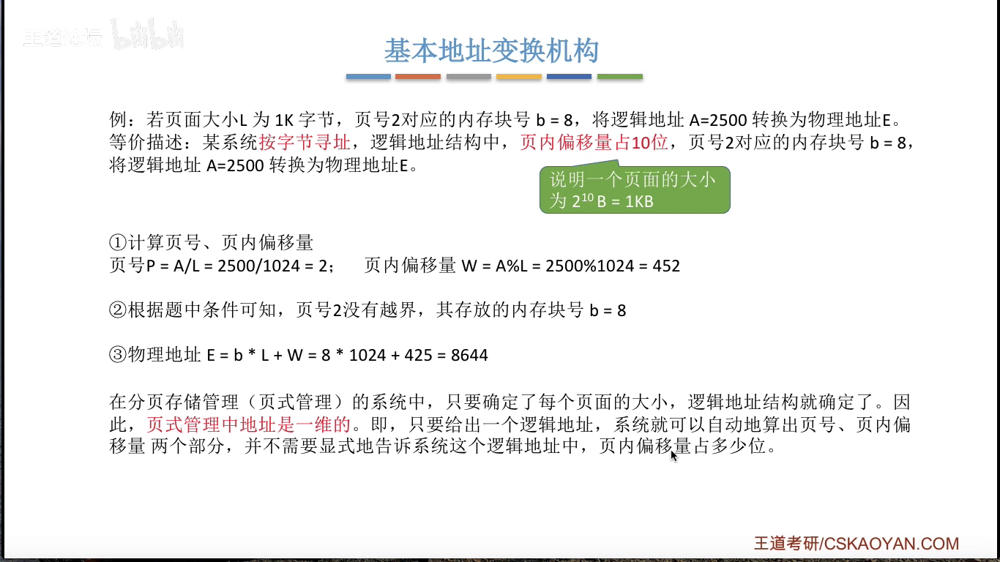
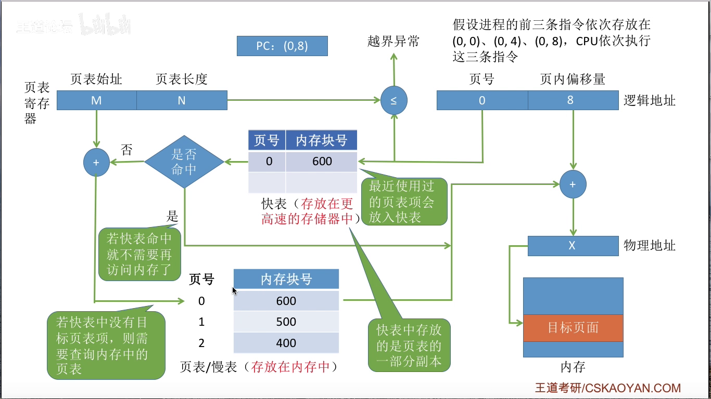

<head>
    

    

    
</head>

# 第三章

## 物理内存

### 内存的基础知识

#### 内存是什么

内存是用于存放数据的硬件，程序执行前要先把数据放在内存中才能被CPU处理。

相对地址又称逻辑地址，绝对地址又称物理地址

从写程序到程序运行
- 编辑源代码文件
- 编译：由目标代码文件生成目标模块
- 链接：由目标模块生成装入模块，`链接后生成逻辑地址`
- 装入：将装入模块装入内存，`装入后形成物理地址`

三种装入方式即逻辑地址到物理地址的转换
- 绝对装入： `在编译的时候就知道程序放在内存的哪个位置`，编译程序将产生绝对地址的目标代码，装入程序按照装入模块中的地址，将程序的数据装入内存。且绝对地址的产生是在编译的时候确定的。
- 静态重定位： 又称可重定位装入，编译链接后的装入模块的地址都是从0开始的，指令中使用的地址，数据存放的地址都是相对于起始地址而言的逻辑地址。可根据内存的当前情况，将装入模块装入到内存的合适位置，装入时对地址进行 重定位 ，将逻辑地址变换为物理地址，且地址变换是在装入时一次性完成的。
  - 特点：一个作业在装入内存时，必须分配其要求的全部内存空间， 如过没有足够的内存则无法装入作业。 且装入后在内存中的地址不能再移动。
- 动态重定位： 又称动态运行时装入。编译链接后的装入模块地址都是从 0 开始的，装入程序把装入模块装入内存后，并不会将逻辑地址转换为物理地址，而是把地址转换推迟到程序真正要执行的时候才进行，因此装入内存后所有的地址依然是逻辑地址，该方式需要装入寄存器的支持。
  - 特点：采用动态重定位时允许程序再内存中发生移动，装入时不需要一次性全部装入。

链接的三种方式
- 静态链接：再运行前将各目标模块及其需要的库函数俩结成一个完整的可执行文件，之后不再拆开
- 装入时动态链接：将目标模块装入内存时，边装入边链接的链接方式。
- 运行时动态链接：在程序执行中需要该目标模块时，才对它进行链接
  - 优点：便于修改和更新，便于实现对目标模块的共享

### 内存管理的概念

内存管理需要做的事情

1. 操作系统负责内存空间的分配和回收
2. 操作系统需要从逻辑上对内存空间进行扩充
3. 操作系统需要提供地址转换功能，负责程序的逻辑地址与物理地址的转换。
4. 操作系统需要提供内存保护的功能，保证各个进程再各自的存储空间内运行互不干扰。
   1. 设置上限下限寄存器
   2. 采用重定位寄存器和界地址寄存器

### 覆盖于交换

#### 覆盖技术

- 解决问题
  - 覆盖技术用来解决程序大小超过物理内存总和的问题
- 思想
  - 将程序分为多个段，常用的段驻入内存，不常用的段需要时调入内存
- 实现方式
  - 内存中分为一个 固定区 和若干个 覆盖区
  - 需要常驻内存的段放在 固定区中， 调入后再执行结束前就不再调出
  - 不常用的段放在覆盖区，需要用到是调入内存，用不到时调出内存
- 缺点：对用户不透明，增加了用户编程负担

#### 交换技术

思想： 内存空间紧张时，系统将内存中某些进程暂时换出内存，把外存中某些具备运行条件的进程换入内存

换出的程序保存再哪里：
- 在具有对换功能的操作系统中，通常把磁盘空间分为文件区和对换区两个部分。 文件区主要用于存放文件，追求存储空间的利用率，因此对文件区的管理采用`离散分配方式`。对换区空间只占磁盘空间的小部分，被换出的进程数据就存放再对换区，由于对换区追求速度，因此对换区通常采用`连续分配方式` 即 对换区的IO速度比文件区的更快。

在什么时候触发交换：
- 交换通常在许多进程运行缺内存吃紧时进行，而系统符合降低就暂停。 比如系统的缺页率明显提升时就要考虑进行交换。
- 交换进程选择策略：可优先换出优先级较低的进程，但是可能导致进程饥饿。

**PCB是常驻内存的，不会被换出**

区别： 覆盖技术是在一个进程内进行的， 交换技术是在不同的进程之间进行的。

### 内存空间的分配和回收

#### 连续分配

> 连续分配指系统为用户分配的进程必须是一个连续的内存空间

单一连续分配
- 思想：内存被分为系统区和用户区。系统区位于内存的低地址部分，用于存放操作系统相关数据。用户区用于存放用户进程相关数据
- 缺点：内存中只能由一道用户程序，用户程序独占整个用户区空间。且会产生 `内部碎片` 
- 优点：实现起来简单， `不产生外部碎片`，可以采用覆盖技术扩充内存，不一定需要内存保护。

固定分区分配
- 思想：将用户区划分为几个固定大小的分区，每个分区仅装入一道作业。
- 划分方式
  - 分区大小相等：缺乏灵活性，但是适用于一套计算机控制多个相同对象的场合。
  - 分区大小不等：增加了灵活性。
- 分配情况记录方式
  - 采用 分区说明表 数据结构
    - 分区说明表包含： 相应分区大小，起始地址，状态等
- 优点：实现简单，无外部碎片
- 缺点：用户程序太大时，可能所有分区都不能满足要求，此时常采用分区覆盖技术来解决但是这样又会降低性能； 其次会产生外部碎片，内存利用率低。

动态分区分配
- 思想：该方式下不会预先划分内存分区，而是在进程装入内存时，根据进程的大小动态地建立分区，并使得分区的大小正好适合进程的需要。此时系统分区的大小和个数是可变的。
- 如何记录内存的使用情况
  - 空闲分区表：每个空闲分区对应一个表项，表项包含了分区号，分区大小，分区起始地址。
  - 空闲分区链：每个分区的起始部分和末尾部分分别设置前向指针和后向指针，起始部分处还可记录分区大小等信息。
- 有多个空闲分区时，如何选择
  - 动态分区分配算法
- 如何进行分区的分配和回收
  - 分配：若请求内存大小小于欲划分内存大小， 则修改表项大小；若相等则移除欲划分表项
  - 回收：
    - 欲回收分区存在相邻空闲分区，则合并
    - 欲回收分区不存在相邻空闲分区，则向空闲分区表添加新的空闲表项
- 碎片产生情况：动态内存分配没有内部碎片，但是有外部碎片。 若内存中空闲空间的总和足够但是不连续导致不能开辟内存给新的进程， 则可以采用`紧凑 或 拼凑` 技术来解决外部碎片。紧凑之后通常要修改进程的起始地址

> 内部碎片：分配给某进程的内存区域中，有些部分没有利用上

> 外部碎片：内存中的某些空闲分区由于太小而难以利用。

在有多个空闲分区可供分配时的选择

首次适应算法 First Fit
- 算法思想： 每次都从低地址开始查找，找到第一个能满足大小的空闲分区

最佳适应算法 Best Fit
- 算法思想： 为了保证未来的大进程有空间可以分配，因此在分配时优先分配较小的内存空间。
- 实现方式：空闲分区按照容量递增次序依次链接，每次分配内存时顺序查找空闲分区链或空闲分区表，找到能满足要求的第一个分区。 每次开辟空间后可能要重新调整空闲分区表或链。
- 缺点： 会留下越来越多的外部碎片

最坏适应算法
- 算法思想： 为了避免太多的外部碎片，每次分配时，优先选择最大的空间
- 缺点：未来到达的大进程可能没有空间以供分配

最邻近适应算法
- 思想：为了避免首次适应算法在低地址出现的很多零碎空间，最邻近适应算法在开辟空间的时候`从上次结束的位置`开始查找
- 实现方法：空闲分区以地址递增的顺序排列（可采用循环链表），每次内存分配时都从上次查找结束的位置开始查找空闲分区链，找到能满足要求的第一个空闲分区。 
- 缺点：高地址的大分区也会被划分为小分区，对未来的大分区不友好。

### 基本分页存储的基本概念

> 连续分区分配的特点： 进程占用的内存必须是连续的。

> 非连续分配的特点： 为用户进程分配的可以是一些分散的内存空间

#### 非连续分配

基本分页存储管理
- 思想：将内存分为一个个相等的小分区，再按照分区大小把进程拆分为一个个小部分。

地址转换的步骤：
1. 算出逻辑地址对应的页面号
2. 知道该页号对应的页面在内存中的起始地址
3. 算出逻辑地址在页面内的 偏移量
4. 物理地址=页面起始地址+偏移量

设置页面大小为 $2^{K}B$ 用二进制数表示逻辑地址， 则末尾的K位即为业内偏移量，其余部分就是页号。

分页存储的逻辑地址包含 页号+页内偏移量 

操作系统会为系统中的每个进程建立一张页表，每个页表项包含页号和块号。

### 基本地址变换机构

基本地址变换机构可以借助进程的页表将逻辑地址转换为物理地址。

通常会在系统中设置一个**页表寄存器 PTR**，存放在内存中的起始地址 F 和 页表长度M。 进程未执行时，页表的起始地址和页表长度放在进程控制块PCB中，当进程被调度时，操作系统内核会把他们放到页表寄存器中。

变换过程：
1. 计算页号P和页内偏移量W。
2. 比较页号P和页表长度M， 若 $P\geq M$ 则产生越界，不继续执行。
3. 页表中页号P对应的页表项地址=页表其实地址F+页号P*页面长度， 取出该页表项内容b即为内存块号。
4. 计算 $E=b*L+W$ 用得到的物理地址E去访存。

页表长度： 这个页表中一共有几个表项

页表项长度：每个表项占用多大存储空间

页面大小：一个页面占用多少存储空间

 
 

    
     
	
地址变换

 
 

### 具有块表的地址变换

程序的局部性原理： 
- 时间局部性
- 空间局部性

含有块表的地址变换过程
1. cpu给出逻辑地址，有某个硬件计算得到页号，页内偏移，将页号于快表中所有的页号进行比较
2. 如果找到匹配的页号，则直接从中取出该页的内存块号，再将内存块号与页内偏移量拼接形成物理地址，最后访问该物理地址对应的内存单元。 即**若块表命中，则访问某个逻辑地址仅需一次访存**
3. 如果没有找到匹配的页号，则需要访问内存中的慢表， 得到页面存放的内存块号，再将内存块号与页内偏移量像拼接形成物理地址，最后访问该物理地址对应的内存单元即可得到需要的数据。（该情况下应更新块表）此时访问虚拟地址需要两次访存。

 
 

    
     
	
地址变换

 
 

### 两级页表

单级页表存在的问题：
1. 需要专门给进程分配的用于存储页表的空间可能很大且必须是连续空间
   1. 解决方案：将页表分组，使得每个内存块刚好能放入一组页表，再将各组离散的放入各内存块中。 此时需要为该离散的页表再建立一张页表，称为 页目录表 或 外层页表 或 顶层页表。 
2. 由局部性原理可知， 一个进程在一段时间内可能仅访问几个特定的页面，因此没必要让整个页表常驻内存。 
   1. 采用虚拟存储技术，给每个页面增加一个标志位 

> 若采用多级页表， 则各页表的大小不能超过一个页面。 

### 基本分段管理方式

> 分段：按照程序自身的逻辑关系划分为若干个分段，每一个段都会有一个段名，每段从 0 开始编号。 

内存分配原则： 以段为单位进行分配，每个段在内存中占用连续的空间， 但是段和段之间可以不连续。

系统分段的逻辑地址结构由 段号+段内地址 所组成。 段号的位数决定了每个进程最多可以分配几个段，段内地址位数决定了每个段的最大长度是多少。

由于段是离散存放的， 入了保证可以从物理内存到逻辑段的映射， 因此系统必须为每个进程建立一张段映射表，简称 **段表**

段表的结构：
1. 每个段对应一个段表项，其中记录了该段在内存中的起始位置（基址），和段的长度（因为段的长度不同）。
2. 各个**段表项**的长度是相同的。 相对于页表隐含页号， 段表也隐含段号

段式地址变换过程：
1. 根据逻辑地址得到段号，段内地址
2. 判断段号是否越界（段号是否大于段表的表长），若越界则产生中断。
3. 查询段表，找到对应的段表表项，段表项的存放地址为 段表起始地址+段号*段表项长度
4. 检查段内地址是否超过段长（内偏的大小是不是大于对应段的段长度）， 若超过则产生越界中断
5. 计算得到的物理地址 段基地址+段内偏移

分段和分页的比较：
- 页
  - 是信息的物理单位。 分页的主要目的是为了实现离散分配，提高内存利用率。分页仅仅是系统管理上的需要，完全是系统的行为，对用户是不可见的。
  - 页的大小式固定且由系统决定的，且页的用户进程地址空间是一维的，只需一个记忆符即可表示一个地址
  - 优点： 内存利用率高，不会产生外部碎片，只会产生少量的内部碎片
  - 缺点： 不方便按照逻辑模块实现信息的共享和保护
- 段
  - 是信息的逻辑单位。分段的主要目的时更好地满足用户的希求，一个段通常包含着一组属于一个逻辑模块的信息。分段对用户是可见的，用户编程时需要显式地给出段名。
  - 段的长度却不固定，决定于用户编写的程序，且段的用户进程地址是二维的，用户编程时既要给出段名，也要给出段内地址。
  - 优点： 很方便按照逻辑模块实现信息的共享和保护
  - 缺点： 如果段长过大，为其分配很大的连续空间会很不方便，且较容易产生外部碎片。

分段比分页更容易实现信息的共享和保护。

### 段页式管理方式

段页式下， 程序先分段后分页， 内存分页

对程序的分段是不透明的，分页对程序员是透明的

一个进程对应一个段表， 但是可能对应多个页表

段页式内存变换过程：
1. 根据逻辑地址得到段号，页号，页内偏移量
2. 判断段号是否越界，越界产生中断
3. 查询段表，找到对应的段表项
4. 检查页号是否越界，越界产生中断
5. 分局页表存放块号，页号查询页表找到对应页表项
6. 根据内存块号，页内偏移量得到最终的物理地址
7. 根据物理地址访问内存单元

整个过程中 3 次访存。

## 虚拟内存

传统内存管理的缺点：
1. 一次性：作业必须一次性全部装入内存后才能开始运行，这会导致
   1. 作业很大时， 不能全部加载入内存，导致大作业无法运行
   2. 当大量作业要求运行时，由于内存无法容纳所有作业，因此只有少量作业能运行， 导致多道程序并发度下降。
2. 主流性：作业一旦被装入内存，就会一直驻留在内存中，直至作业运行结束，但是进程在一个时间短内只需要访问一小部分数据就行，这就导致内存中会驻留大量的，暂时不用的数据，浪费了内存资源。

虚拟内存的最大容量是由计算机的地址结构决定的

虚拟内存的实际容量=min(内存和外存的容量之和， CPU寻址范围)

虚拟内存的特征：
1. 多次性：无需在作业运行时一次性全部装入内存，而是允许被分成多次调入内存
2. 对换性：在作业运行时无需一直驻留内存，而是在作业运行过程中按需将作业调入或调出
3. 虚拟性：从逻辑上扩充了内存的容量。

虚拟内存的实现
1. 请求分页存储管理
2. 请求分段存储管理
3. 请求段页式存储管理

请求分页存储管理
- 页表项的字段
  - 内存块号
  - 状态位： 页面是否调入内存
  - 访问字段： 根据该字段来决定调出哪个页面
  - 修改位： 用来标记该页面是否被修改过
  - 外存地址： 页面在外存中的存放位置

缺页中断：因为当前执行的指令想要访问的页面未调入内存，因此属于内中断

一条指令中可能产生两次中断

缺页中断未必发生页面置换，因为可能还有空闲的位置以供使用。

### 页面置换算法

最佳置换算法 OPT 
- 思想：每次淘汰时选择以后用不使用的页面或者在最长时间内不再被访问的页面，这样可以保证最低的缺页率。
- 可以保证最低的缺页率，操作系统无法提前预判页面的访问序列因此最佳置换算法是无法实现的。

先进先出算法 FIFO
- 思想：每次先择淘汰的页面是最早进入内存的页面
- 实现方式：将调入内存的页面根据调入顺序排成一个队列，需要时换出对头的页面即可
- 实现简单但是会产生 belady 异常， 因此算法性能较差。

最近最久未使用置换算法 LRU
- 思想：每次淘汰最久未被访问的页面
- 性能较好，但是实现起来硬件开销比较大

时钟置换算法 CLOCK 或 最近未使用算法 NRU
- 思想：为每个页面设置一个访问位，再将内存中的页面都通过链接指针链接成一个循环队列。 当某页被访问时，其访问位置为1。 当需要淘汰一个页面时，秩序检查页的访问位。如果是 0 就选择该页面换出， 如果是 1 则将它置为 0 ，暂时不换出继续检查下一个页面内，若第一次道面中所有的页面都是 1 ，则将这些页面的访问位依次置为 0 后， 在进行第二轮扫描。因此简单的 CLOCK 算法 选择一个淘汰页面最多会进行两轮扫描。
- 访问位为 1 表示最近访问过， 访问位为 0 表示最近未访问过。

改进型的时钟置换算法
- 思想： 如果一个页面没有被修改， 则替换时不需要写回。 在淘汰时优先选择未使用中的未修改页面来减少IO的开销。
- 修改位为 1 则修改过 为 0 则未被修改过。
- 扫描过程 (访问位，修改位)
  - 第一轮： 从当前位置开始扫描第一个(0,0)的帧用于替换，本轮扫描不修改任何标志位。 **淘汰最近没访问且没修改的页面**
  - 第二轮： 若第一轮失败，则重新扫描查找第一个(0,1)的帧用于替换。本轮将所有扫描过的帧的访问位设置为 0。**淘汰最近没访问但修改过的页面**
  - 第三轮： 若第二轮扫描失败，则重新扫描，查找第一个(0,0)的帧用于替换，本轮扫描不修改任何标志位。**淘汰最近访问过且没修改的页面**
  - 第四轮： 若第三轮扫描失败，则重新扫描，查找第一个(0,1)的帧用于替换，本轮扫描不修改任何标志位。**淘汰最近访问过且修改过的页面**
- 进行一次替换最多需要进行 4 轮扫描。
- 开销小，性能也不错

### 页面分配策略

> 驻留集：指请求分页存储管理中给进程分配的物理块的集合。 在采用了虚拟存储技术的系统中，驻留集的大小一般小于进程的总大小。

页面的分配
- 固定分配：驻留集的大小分配好后不可变
- 可变分配：驻留集的大小在运行的过程中可以适当的增加或减少

页面的置换
- 局部置换：发生缺页时`只能选进程自己的物理块`进行置换。
- 全局置换：可以将操作系统保留的空闲物理块分配给却也进程，也可以将其他进程持有的物理块置换到外存，再分配给缺页进程。

页面策略
- 固定分配局部置换： 系统为每一个进程分配一定数量的物理块，在整个运行期间都不能改变
- 可变分配局部置换： 系统为进程分配的物理块是可以改变的，在运行过程中如果进程的物理块不够用， 则选择一个`自己的物理块`换出外存。如果程序执行的过程中频繁的缺页，则系统会为该进程多分配几个物理块，若缺页率特别低也会相应的减少其物理块使其最终维持在一个合理的水平。**根据缺页率来适当的调整物理块**
- 可变分配全局置换：系统为进程分配的物理块是可以改变的，在运行过程中如果进程的物理块不够用，则从空闲的物理块中取出一块分配个该进程。如果已经没有空闲的物理块则先择一块`未被锁定`的物理块换出内存，该物理块可能是其他进程持有的物理块。 **只要缺页就分配新的物理块**

**未被锁定的物理块指的是存放的数据不是操作系统内核数据的物理块**

合适调入页面
- 预调页策略： 根据局部性原理，一次调入若干个相邻的页面。由于成功率不高因此仅在进程首次调入的时候采用该策略。
- 请求调页策略： 进程在运行期间发现缺页时才将所缺页面调入内存。该策略下调入的页面必然会被访问到。但是由于每次只能调入一页，且必须IO，因此IO开销比较大。

从何处调入页面
- 若系统拥有足够的对换区空间：页面的调入调出都是内存和对换区之间进行。程序运行之前需将进程相关的数据从文件区复制到对换区。
- 若系统缺少足够的对换区空间：凡是不会被修改的数据都是直接从文件区调入内存而不必写回磁盘，但是对于需要修改的数据则需要写回到对换区，下次在使用时从对换区调入。
- Unix方式：程序运行之前所有的数据都放在文件区，使用过程中换出的页面放入对换区。

抖动/颠簸现象： 刚刚换出的页面马上又要换入。产生的主要原因是进程频繁访问的页面数量高于可使用的物理块数。

> 驻留集： 指请求分页存储管理中给进程分配的内存块的集合

> 工作集： 指在某段时间间隔内，进程实际访问的页面集合。 一般来讲驻留集大小不能小于工作集大小，不然容易发生抖动。

[返回](../index.md)
 

