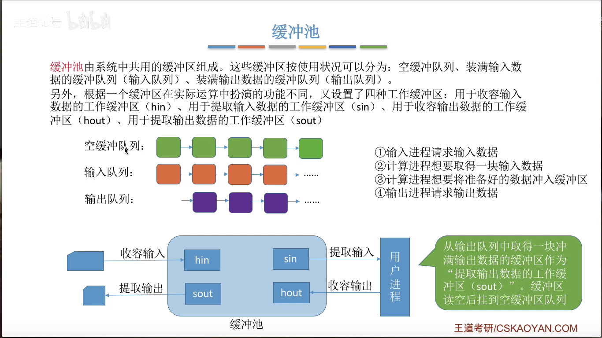

# 第五章

## 设备管理

### IO设备的概念和分类

IO设备：可以将数据输入到计算机或者将数据输出到外部的设备

按照信息传输的单位：
- 块设备： 传输快， 可寻址
- 字符设备： 传输慢，不可寻址 通常采用 中断驱动

### IO控制器

IO设备的机械部件主要用来执行具体的IO操作， 电子部件通常是印刷电路板

IO控制器又称设备控制器，CPU通过控制IO控制器来控制设备的IO部件

IO控制器的功能
- 接受和识别CPU发出的命令
  - 通过操纵 控制寄存器实现
- 向CPU报告设备的状态
  - 通过操纵 状态寄存器实现
- 数据交换
  - 通过操纵 数据寄存器实现
- 地址识别
  - 通过操纵 CPU提供的地址实现

### IO控制方式

程序直接控制方式
- 过程
  - CPU向IO模块发出读命令字
  - CPU轮询IO模块的状态是否准备好
  - CPU从IO模块中读取数据字
  - CPU将读取到的数据字从自己的寄存器中迁移到存储器中
  - CPU查询IO模块以确定数据传输是否结束。
- CPU的干预频率：很频繁，IO操作开始之前，完成之后需要CPU介入，并且在等待IO完成的过程中需要不断的轮询检查。
- 数据的传送单位： 每次读写一个字
- 数据的流向
  - 读： IO设备-CPU-内存
  - 写： 内存-CPU-IO设备
- 优点： 实现简单
- 缺点： CPU和IO只能穿行的工作，CPU需要一直轮询检查，长期处于忙等状态， CPU利用率低。

中断驱动方式
- 过程
  - CPU给IO模块发出读命令`之后去做其他的事情`
  - IO模块数据准备好后，发出中断请求
  - CPU从IO模块中读取数据字到数据寄存器
  - CPU将数据寄存器中的数据字写入到存储器中
  - CPU判断IO是否结束
- CPU干预频率： 每次IO操作开始之前，完成之后需要CPU介入，但是在等待IO的过程中，CPU可以执行其他的程序
- 数据传送的单位： 数据字
- 数据的流向
  - 读： IO设备-CPU-内存
  - 写： 内存-CPU-IO设备
- 优点： IO控制器会主动向CPU报告IO进行情况，而CPU不需要轮询可以和IO并行工作，CPU的利用率有所提升。
- 缺点： 每个字在IO设备与内存之间传输，都需要经过CPU，而频繁的中断处理还是会消耗较多的cpu资源。

MDA方式
- 过程
  - CPU对DMA控制器进行初始化，并对IO模块发出读块命令之后就可以去做其他的事情
  - 在DMA控制器的控制下将数据从IO设备存放到存储器中
  - 当一个块传输结束后，DMA设备发出中断请求，此时CPU再进行数据检查等工作
- CPU干预率：仅在传送一个或者多个数据块开始的时候和结束的时候才需要CPU干预
- 数据的传送单位：每次读写一个或多个数据块，如果读写多个数据块则要求这些数据块的存放地址要连续。
- 数据的流向
  - 读： IO设备-内存
  - 写： 内存-IO设备
- 优点： 数据传输以 块 为单位，CPU的介入频率进一步降低，数据传输不需要经过CPU再写入内存，CPU和IO设备的并行性得到进一步提升。
- 缺点： CPU每发出一条指令，只能读或者写一个或多个连续的数据块，若数据块的存放离散，则只能多次读写。

通道控制方式

### IO软件层次结构

结构层次
- 用户层软件
- 设备独立性软件
- 设备驱动程序
- 中断处理程序
- 硬件

IO核心子系统包括：设备独立性软件，设备驱动程序，中断处理程序

中断处理程序和设备处理程序是和硬件直接交互的

### 假脱机技术

> 脱机技术： 脱离CPU的控制进行工作。

> 假脱机技术： 又称 SPOOLing技术 使用软件的方式模拟脱机技术。

输入进程将数据从输入设备传输至输入缓冲区，再放入磁盘的输入井中。

输出进程将数据从磁盘的输出井中拿出存放到输出缓冲区再传送至输出设备。

### 设备的分配与回收

设备分配时应考虑的因素
- 设备的固有属性
- 设备分配算法
- 设备分配中的安全性
  - 安全分配方式： 为进程分配一个设备后就将进程阻塞， 本次IO完成后才将进程唤醒
    - 优点：破坏了请求和保持条件，不会死锁
    - 缺点：对于一个进程来说，CPU和IO只能串行工作
  - 不安全分配方式：进程发出IO请求后， 系统为其分配IO设备，进程可继续执行，之后还可以发出新的IO请求。只有IO请求得不到满足时才将进程阻塞。
    - 优点：进程的计算任务和IO任务可以并行处理，使进程迅速推进。
    - 缺点：有可能发生死锁。

设备分配方式
- 静态分配：必须所有资源都满足才允许进程运行
- 动态分配：在运行的过程中动态的分配设备资源

设备分配管理中的数据结构
- 设备控制表 DCT： 系统为每个设备分配一张DCT，用于记录设备情况。
  - 每个表项包含 
    - 设备类型
    - 设备标识符
    - 设备状态
    - 指向设备控制表的指针
    - 重复执行次数或时间
    - 设备队列的队首指针
- 控制器控制表 COCT： 每个设备控制器都会对应一张 COCT。 操作系统根据COCT的信息对控制器进行操作和管理。
  - 每个表项包含
    - 控制器标识符
    - 控制器状态
    - 指向通道表的指针
    - 控制器队列的队首指针
    - 控制器队列的队尾指针
- 通道控制表 CHCT： 每个通道都会对应一张CHCT，操作系统根据CHCT的信息对通道进行操作和管理
  - 每个表项包含
    - 通道标识符
    - 通道状态
    - 与通道连接的控制器表首址
    - 通道队列的队首指针
    - 通道队列的队尾指针
- 系统设备表 SDT: 记录了系统中全部的设备，每个设备对应一个标目
  - 每个表项包含一个表目
    - 每个表目包含
      - 设备类型
      - 设备标识符
      - DCT
      - 驱动程序入口

设备分配的步骤：
1. 根据进程请求的物理设备名查找 SDT
2. 根据SDT找到DCT，若设备忙碌则将进程PCB挂到设备等待队列中，不忙碌则将设备分配给进程。
3. 根据DCT找到COCT
4. 根据COCT找到CHCT
5. 缺点
   1. 用户编程时必须使用物理设备名，不方便编程
   2. 若换了一个物理设备，则程序无法运行
   3. 若进程请求的物理设备正在忙碌，则即便系统中同类型的设备空闲进程也必须阻塞等待

改进：在查找时使用逻辑设备名

### 缓冲区管理

> 缓冲区： 一个存储区域，可以由专门的硬件寄存器组成也可使用内存作为缓冲区

缓冲区的特点： 非空不可写，非满不可读。

缓冲区的作用：
- 缓和CPU与IO设备之间速度不匹配的矛盾
- 减少CPU的中断频率，放宽对CPU中断相应时间的限制
- 解决数据粒度不匹配的问题
- 提高CPU与IO设备之间的并行性

缓冲区策略
- 单缓冲： 在内存中分配一个块大小的空间
- 处理一块数据需要的时间为 从设备到内存缓冲区的时间 T + 从内存缓冲区到用户工作进程的时间 M + CPU处理的时间 C 
- 但缓冲策略下，处理一块数据平均耗时 $Max(C, T)+M$
  
双缓冲策略：内存中有两个缓冲区

此时平均处理一个数据块消耗时间为 $Max(T, C+M)$ 

缓冲池

 
 

    
     
	
缓冲池

 
 

[返回](../index.md)